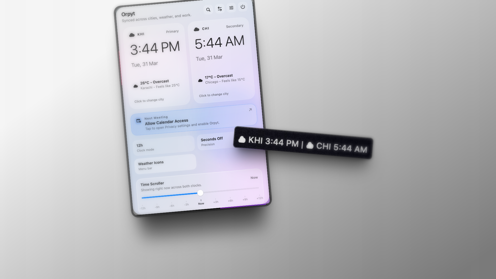

<p align="center">
  
</p>

<h1 align="center">Orpyt</h1>

<p align="center">
  <strong>A native macOS menu bar clock for people working across time zones.</strong>
</p>

<p align="center">
  <a href="https://apps.apple.com/app/orpyt/id6744642680"></a>
  <a href="https://github.com/aihtshamali/orpyt/blob/main/LICENSE"></a>
  
  
</p>

<p align="center">
  Orpyt keeps two cities in sync with a fast popover, a full settings window, optional live weather, quick search, a time scroller, and calendar context.
</p>

<p align="center">
  
</p>

<p align="center">
  
</p>

---

## Download

Orpyt is available on the **Mac App Store** with a 7-day free trial.

**[Download on the Mac App Store →](https://apps.apple.com/app/orpyt/id6744642680)**

Requirements: macOS 13 Ventura or later.

> Prebuilt binaries are no longer distributed via GitHub Releases. Install through the App Store to get signed, notarized builds with automatic updates.

---

## Free Features

- Dual clocks in the macOS menu bar
- Search any city, country, or time zone worldwide
- 12h / 24h display and seconds toggle
- Custom labels for each clock
- Show one clock or both
- Launch at login
- Clean, native macOS design

## Orpyt Pro

Start with a 7-day free trial. Cancel any time — one tap, no forms.

- Live weather on every clock card
- Next meeting context from your calendar
- Time Scroller — scrub forward or backward to find the perfect meeting time across zones
- Advanced appearance controls

---

## Features

- Dual clocks directly in the macOS menu bar
- Configurable primary and secondary time zones
- Show one clock or both
- Quick search from the popover to swap cities fast
- Current time zone shortcut from the popover and settings
- Optional 24-hour format
- Optional seconds, weekday, date, timezone abbreviation, and GMT offset
- Custom labels for each clock
- Native launch at login toggle
- Ambient or weather-based icon mode
- Live weather with graceful fallback
- Time scroller with slider and trackpad / mouse wheel scrubbing
- Optional read-only next meeting card in the popover
- Native settings window
- Smooth, animated overview cards

---

## Requirements

- macOS 13 Ventura or later
- Xcode 15 or later (to build from source)
- Apple Developer account only if you want signed WeatherKit builds or production launch-at-login behavior

---

## Project Layout

- `Sources/App/OrpytApp.swift` — app entry and AppKit integration
- `Sources/OrpytCore/` — shared views, stores, models, weather, and utilities
- `Tests/OrpytTests/` — formatter, store, catalog, and scroller coverage
- `Package.swift` — Swift package manifest
- `Orpyt.xcodeproj` — canonical Xcode project
- `Orpyt.entitlements` — app entitlements (WeatherKit, etc.)
- `Assets/` — app logo and screenshots
- `build-app.sh` — local bundle builder
- `release.sh` — release archive and App Store build helper

---

## Performance

Orpyt is designed to stay out of the way when it is not being used.

- Idle CPU usage measured at `0.0%` to `0.1%`
- Activity Monitor power field measured at `0.0` during idle sampling
- Resident memory measured at roughly `56 MB` to `99 MB`, depending on the metric used
- Thread count measured at `4`

Sampled from a running menu bar instance on Apple silicon, idle, not under synthetic stress.

---

## Build from Source

Clone the repo and build the app bundle locally:

```bash
git clone git@github.com:aihtshamali/orpyt.git
cd Orpyt
./build-app.sh
open dist/Orpyt.app
```

After building, drag `dist/Orpyt.app` into `Applications` and run it like a normal macOS app.

> Builds compiled from source use the `DIRECT_DISTRIBUTION` flag and include the free feature set. Orpyt Pro is distributed through the Mac App Store version.

---

## Open in Xcode

```bash
open Orpyt.xcodeproj
```

---

## Philosophy

Orpyt is designed to feel:

- **fast to glance**
- **calm to use**
- **invisible when not needed**

Every detail — from spacing to animation — is intentional.

---

## Contributing

Contributions are welcome.

- Open an issue for discussion
- Submit a focused pull request
- Keep changes simple and consistent

---

## License

See [`LICENSE`](./LICENSE) for details.
